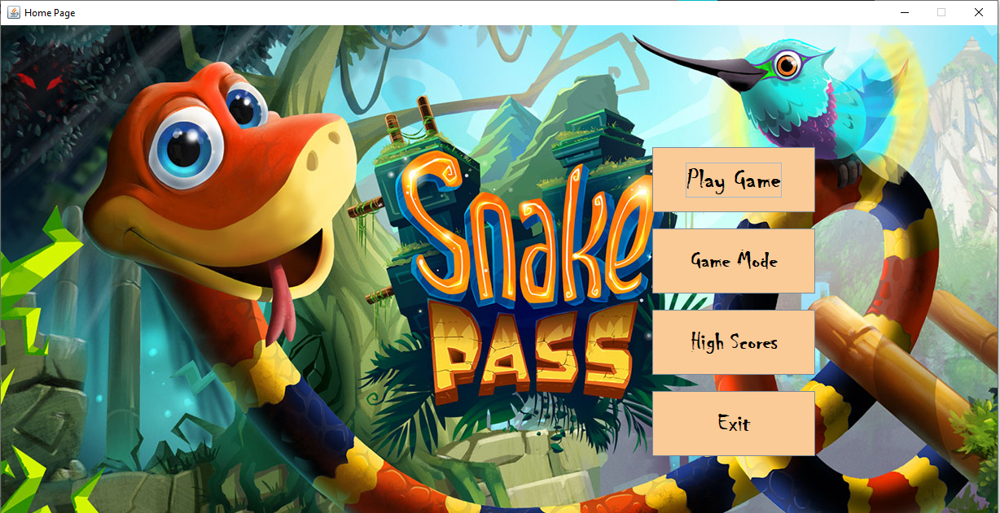
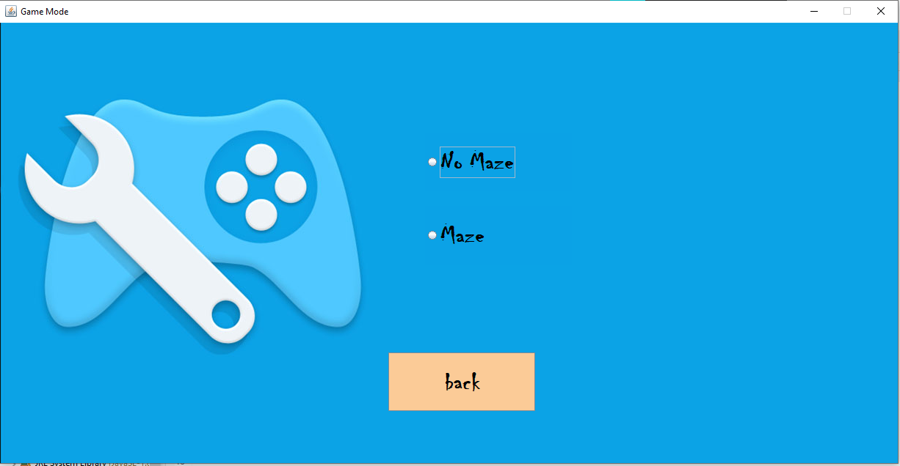
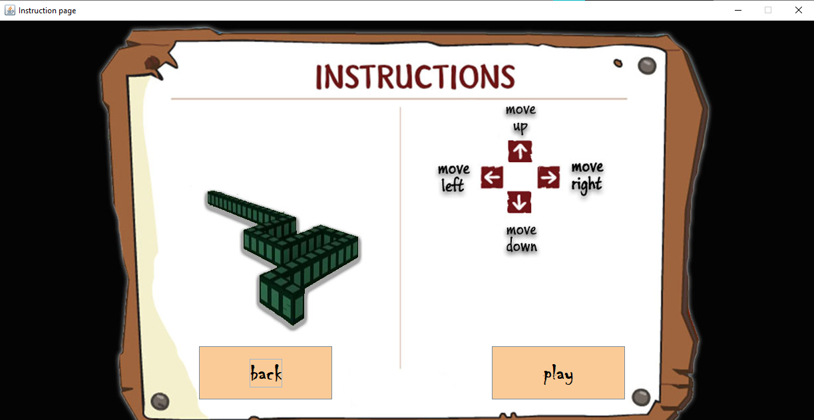
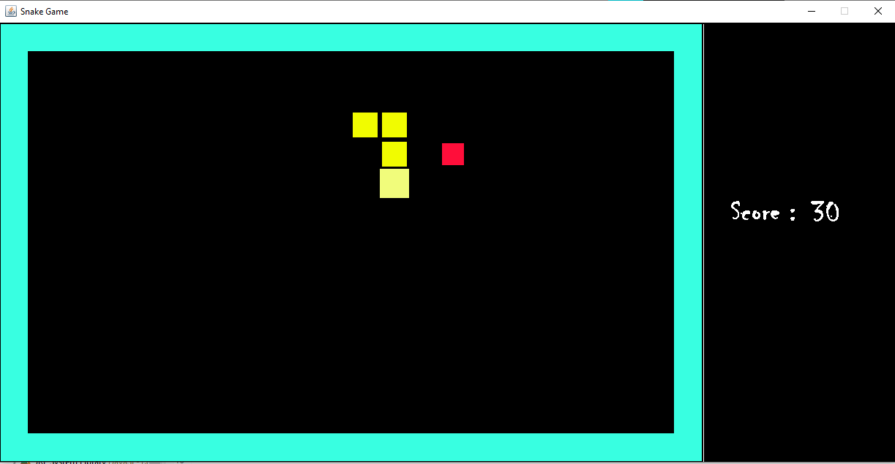
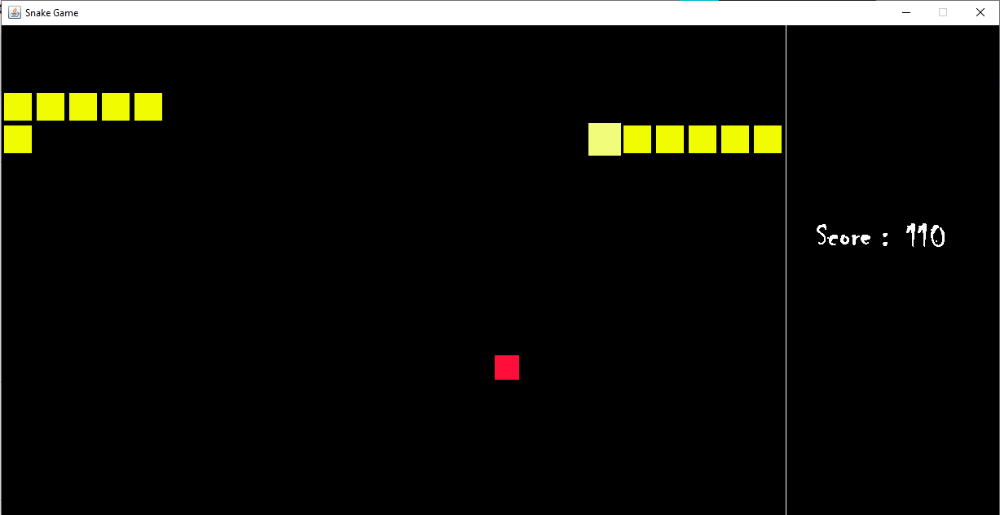
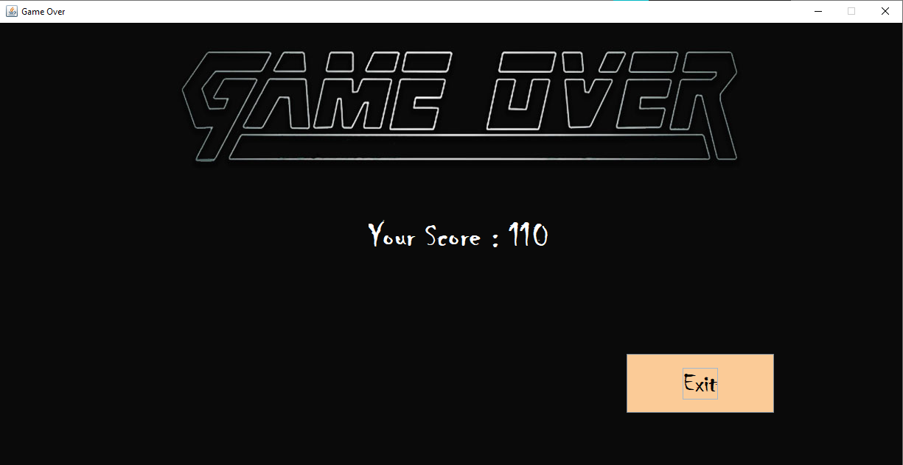

# Snake-java
This project was made in 2018. This application was made for my university project. Back Then I was learning android so I made a simple game that I have built before.

## Project description
Name: Snake  
Programming Language: Java  
GUI: javaSwing  
Project No: 8  
Year: 2018

## Demo Video

## Screen shot
### Homescreen
 

### Game mode
 

### Instruction Page
 

### Game Window

#### Maze mode
 

#### No maze
 

### GameOver
 

## Authors

* **AbirHasan**

Check out my other works [@XAbirHasan](https://github.com/XAbirHasan)
